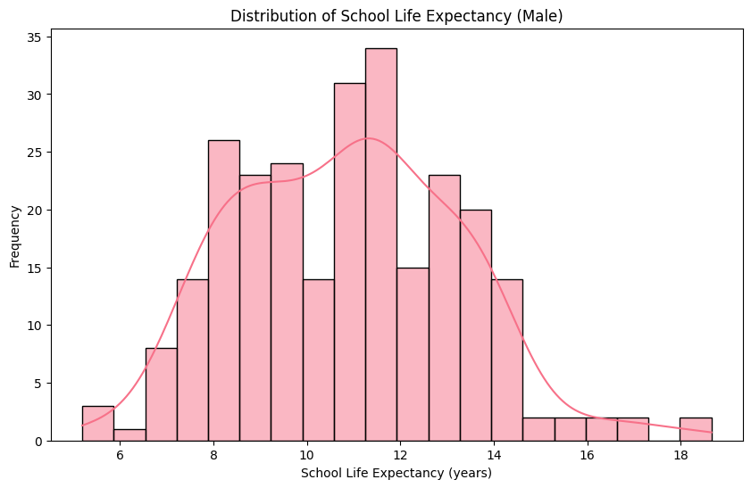
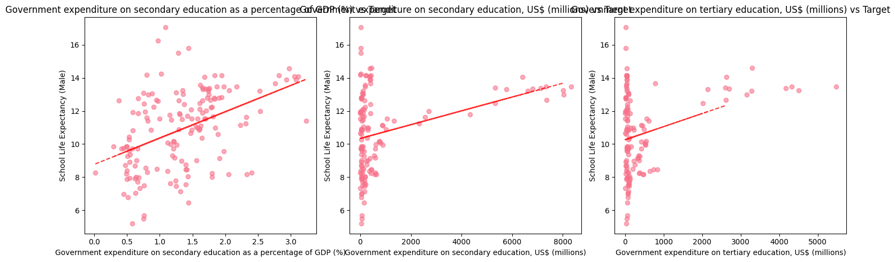

# Education Prediction Linear Regression Model

## Mission
To bridge the education gap for rural students by providing access to high-quality learning materials and technologies and fostering their potential through exchange programs in advanced regions to inspire them to achieve great things and uplift their communities.

## Problem and Relevance
This project addresses the education gap in rural communities by building a machine learning model that predicts school life expectancy based on government expenditure patterns. The model helps policymakers understand the relationship between educational investment and outcomes, enabling better resource allocation decisions to bridge the education gap for rural students.

## Data Source
- The dataset used for this project is publicly available on Kaggle: [Education in Africa Dataset by Lydia70](https://www.kaggle.com/datasets/lydia70/education-in-africa)
- File used: `Education in General.csv` (located in `summative/linear_regression/`)

## Key Visualizations

### Distribution of School Life Expectancy (Male)
This histogram shows the distribution of school life expectancy for males across African countries in the dataset.


### Top Features vs. School Life Expectancy
Scatter plots below show the relationship between the top three features and school life expectancy (male), with trend lines indicating correlation.


## API Endpoint
**Public API URL:** https://education-prediction-api.onrender.com

**Swagger UI Documentation:** https://education-prediction-api.onrender.com/docs

**Prediction Endpoint:** POST /predict

## Video Demo
**YouTube Link:** [Demo Video](https://youtu.be/T2eCIH3MgBA)

## How to Run the Mobile App

### Prerequisites:
- Flutter SDK (version 3.8.1 or higher)
- Android Studio / VS Code with Flutter extension
- Android emulator or physical device

### Installation Steps:

1. **Clone the repository:**
   ```bash
   git clone https://github.com/oreste-abizera/linear_regression_model.git
   cd linear_regression_model
   ```

2. **Navigate to Flutter app:**
   ```bash
   cd summative/FlutterApp
   ```

3. **Install dependencies:**
   ```bash
   flutter pub get
   ```
4. **Run the app:**
   ```bash
   flutter run
   ```
